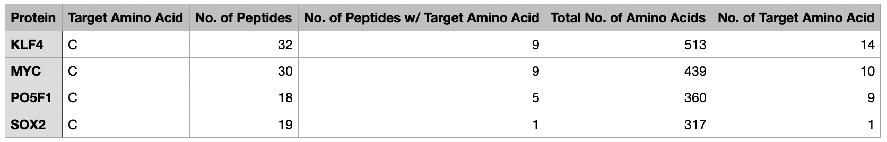
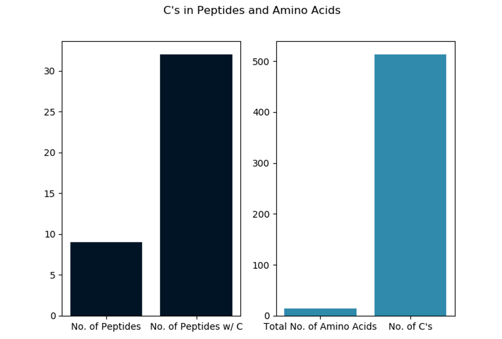

# Bioinformatics Pipeline Tutorial

This is the accompanying GitHub repository for this blog post: https://ricomnl.com/blog/bottom-up-bioinformatics-pipeline/.


## Outline
The workflow we're going to wrap in a pipeline looks like this:
1. Take a set of .fasta protein files
2. Split each into peptides using a variable number of missed cleavages
3. Count the number of cysteines in total as well as the number of peptides that contain a cysteine
4. Generate an output report containing this information in a .tsv file
5. Create an archive to share with colleagues






## Prerequisites
### MacOS
```
# Add project to your path for this session.
export PATH="$PATH:$(pwd)"

# Open the terminal; Install utilities for homebrew
xcode-select --install

# Install homebrew
/bin/bash -c "$(curl -fsSL https://raw.githubusercontent.com/Homebrew/install/HEAD/install.sh)"

# Install python3
Follow this tutorial: https://opensource.com/article/19/5/python-3-default-mac

# Install make
brew install make

# Install git
brew install git

# Install matplotlib
pip3 install matplotlib

# Install Nextflow (https://www.nextflow.io/docs/latest/getstarted.html)
wget -qO- https://get.nextflow.io | bash
chmod +x nextflow
## Move Nextflow to a directory in your $PATH such as /usr/local/bin
mv nextflow /usr/local/bin/
```

### Linux
```
# Install python3, git and make
sudo apt-get update
sudo apt-get install python3 git make

# Install matplotlib
sudo apt-get install python3-matplotlib

# Install Nextflow (https://www.nextflow.io/docs/latest/getstarted.html)
wget -qO- https://get.nextflow.io | bash
chmod +x nextflow
## Move Nextflow to a directory in your $PATH such as /usr/local/bin
mv nextflow /usr/local/bin/
```